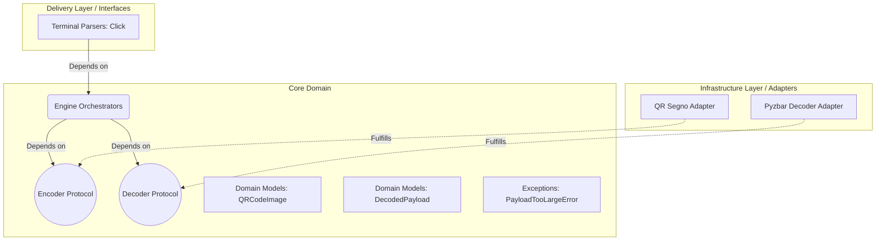

# QR Tool CLI: A Hexagonal Architecture Implementation

## Overview

The QR Tool is a professional-grade, standalone CLI application for generating and decoding QR codes.

More importantly than its feature set, this project serves as a reference implementation of **Hexagonal Architecture (Ports and Adapters)** in standard Python. It demonstrates how to violently decouple standard I/O (the terminal), business logic (the engine), and third-party dependencies (the underlying QR maths).

## Installation

Because this tool relies on advanced image processing and decoding libraries, you must have the `zbar` shared library installed on your system if you are installing natively.

If you have [uv](https://github.com/astral-sh/uv) installed, you can install the tool globally on your machine in a single, isolated command:

```bash
# MacOS Users must install zbar first:
brew install zbar
# Then install the CLI globally:
uv tool install git+https://github.com/nathan-trann/qr-generator
```

You can now run `qr_generator` anywhere on your computer.

## Architectural Design

This project is structured using the Hexagonal Architecture pattern.



## Why Hexagonal Architecture?

- **Testability Without I/O**: The Core Engine is isolated. It doesn't know what a PNG file is, nor does it know about the `click` library. We can unit test the Core Domain orchestration rules mathematically and synchronously in `0.01` seconds without generating temporary files or making network calls.
- **True Dependency Inversion**: The Core Domain defines Protocols (Interfaces). The Infrastructure Adapters (Segno, Pyzbar) are forced to conform to the Core's requirements, rather than the Core warping its data structures to satisfy the 3rd party libraries.
- **The Anti-Corruption Layer**: When `pyzbar` accidentally triggers a `UnicodeDecodeError` or a `ValueError`, that error does not bubble up to the CLI. The Adapter layer catches it, translates it to a `QRToolError` (Domain Exception), and passes it to the CLI.

## Layer Breakdown

### 1. Core Domain (`src/qr_tool/core/`)

The absolute center of the application. It contains zero third-party logic.

- **Models**: Strict definitions of what a QR Code and a payload are (`models.py`).
- **Engine**: Orchestration rules and Protocol definitions (`engine.py`).
- **Exceptions**: Custom domain errors specific to our business logic (`exceptions.py`).

### 2. Infrastructure (`src/qr_tool/infra/`)

The layer that talks to the 3rd party libraries.

- **Encoder Adapter**: Wraps the `segno` library, translating standard bytes strings into byte-streamed matrices.
- **Decoder Adapter**: Wraps the `pyzbar` and `Pillow` libraries, utilizing defensive heuristics (ratio testing against `string.printable`) to differentiate text from binary data.

### 3. Delivery (`src/qr_tool/cli/`)

The presentation layer.

- Builds upon the Unix philosophy utilizing `click` to handle arbitrary `stdin` piping, path resolution, and isolated standard output formatting.

## Development & Testing Workflow

This project defines strictly structured testing tiers, isolated from one another. Tests are managed via `pytest` provided gracefully through `uv`.

Ensure your environment is set up via:

```bash
uv sync
```

Run Tests:

```bash
uv run pytest
```

### Testing Strategy

- **Domain Tests (`test_core.py`)**: Pure python logic tests utilizing lightweight "Fake Adapters" to simulate failing infrastructure. Proves the Anti-Corruption logic translates external value errors into Domain Errors.
- **E2E Terminal Tests (`test_cli.py`)**: Simulates Unix environments using `CliRunner` to verify that stdin piping, output creation caching (via the `isolated_filesystem()`), and user-facing terminal color-coding function identically to a real Bash environment.
